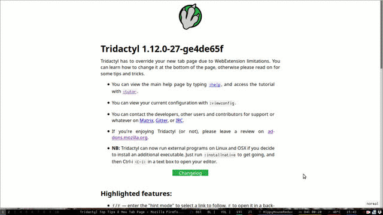

<h1 align="center">
<br>

<br>
Tridactyl
<br>
</h1>

<h4 align="center">Replace Firefox's default control mechanism with one modelled on the one true editor, Vim.</h4>

<p align="center">
<a href="https://travis-ci.org/tridactyl/tridactyl"></a>
<a href="https://matrix.to/#/#tridactyl:matrix.org"></a>
<a href="https://gitter.im/tridactyl/Lobby"></a>
<a href="https://discord.gg/DWbNGTAvmh"></a>
<a href="https://addons.mozilla.org/en-US/firefox/addon/tridactyl-vim/"></a>
</p>

<p align="center">
<a href="#installation">Installation</a> •
<a href="#changelog">Changelog</a> •
<a href="#first-look">First Look</a> •
<a href="#highlighted-features">Features</a> •
<a href="#frequently-asked-questions-faq">FAQ</a> •
<a href="#contributing">Contributing</a>
</p>

<br>

<p align="center">

</p>

## Installation

[Click this link in Firefox to install our latest "beta" build][riskyclick]. If it doesn't install automatically, you may need to 1) rename the extension from `.zip` to `.xpi` and 2) open it with Firefox; a fool-proof method is to go to `about:addons`, click the extensions tab, click the cog in the top right, then click "Install Add-on From File...". If you want more options, read on.

### Stable

Our "stable" builds are essentially just frozen versions of our beta builds. Our beta builds themselves are not much less stable; all our developers and about half of our users use the beta builds. Stable builds, however, do get new features documented in the changelog, whereas beta builds get new features before they are documented there.

#### Arch Linux

Run `pacman -S firefox-tridactyl` in a terminal and then restart Firefox _twice_.

#### All other operating systems (Microsoft Windows, Macintosh, Linux etc.)

Tridactyl stable can be installed from the [Mozilla add-ons website (the AMO)][amo].

### Beta

[Click this in Firefox to install our "beta" builds][riskyclick]. These [betas][betas] used to be updated with each commit to master on this repo but are now built manually when bovine3dom remembers - see [issue #3605](https://github.com/tridactyl/tridactyl/issues/3605). Your browser will automatically update from there once a day. If you want more frequent updates, you can change `extensions.update.interval` in `about:config` to whatever time you want, say, 15 minutes (900 seconds). There is also another beta build that comes without a new tab page. You can get it from [here][nonewtablink].

### Extra features through [Native Messaging](https://developer.mozilla.org/en-US/docs/Mozilla/Add-ons/WebExtensions/Native_messaging)

If you want to use advanced features such as edit-in-Vim, you'll also need to install the native messenger or executable, instructions for which can be found by typing `:installnative` and hitting enter once you are in Tridactyl. Arch users can install the [AUR package](https://aur.archlinux.org/packages/firefox-tridactyl-native/) `firefox-tridactyl-native` instead.

#### Containerized/sandboxed Firefox Installations

**Snap and Flatpak:** Native Messaging support here is fairly recent and may require:

* Upgrading to a beta version of Firefox (`>= 106.0b6`)
* Enabling webextension permissions: `flatpak permission-set webextensions tridactyl snap.firefox yes`
* Rebooting your system (and likely nothing short of it)

See [this call for testing thread](https://discourse.ubuntu.com/t/call-for-testing-native-messaging-support-in-the-firefox-snap/29759) and [this PR](https://github.com/tridactyl/tridactyl/pull/4406) for more details and troubleshooting tips.

**Firejail** will require explicit path whitelisting, but should be feasible based on https://github.com/netblue30/firejail/issues/2109.

For other containerized installs, see troubleshooting steps in https://github.com/tridactyl/tridactyl/issues/2406 and the links above.
With packaging that does support Native Messaging, the trick is usually ensuring the containerized app has permission to run the executable and can find the [manifest json file](https://wiki.mozilla.org/WebExtensions/Native_Messaging#Host_Manifests).

### Migrating between beta and stable builds

Our beta and stable versions store their configurations in separate places. To migrate between the two, see [the wiki](https://github.com/tridactyl/tridactyl/wiki/Migration-from-stable-to-beta).

## Changelog

The changelog for the stable versions can be found [here](https://github.com/tridactyl/tridactyl/blob/master/CHANGELOG.md).

## First look

Type `:help` or press `<F1>` for online help once you're in, or `:tutor` for a friendly introduction. You might also find the [unofficial Tridactyl Memrise course](https://app.memrise.com/community/course/5995499/tridactyls-main-shortcuts/) (requires login) useful for memorising keybinds.

Remember that Tridactyl cannot run on any page on about:\*, data:\*, view-source:\* and file:\*. We're sorry about that and we're working with Firefox to improve this situation by removing restrictions on existing APIs and developing a new API.

If you're enjoying Tridactyl, or not, please leave a review on the [AMO](https://addons.mozilla.org/en-US/firefox/addon/tridactyl-vim/reviews/).

## Highlighted features

Like Vim, Tridactyl is modal, with the default mode being "normal mode". In "normal mode", many functions are available using keybindings. In "command mode" (when the command line is shown), you can execute more complex commands, known as "ex-commands". All Tridactyl functionality can be accessed by ex-commands. You can bind any ex-command to a normal-mode shortcut. We also support a `.tridactylrc` file, of which there is an example in the root of this repository.

### Default normal-mode bindings

This is a (non-exhaustive) list of the most common normal-mode bindings. Type `:help` to open the online help for more details.

-   `:` — activate the command line
-   `Shift` + `Insert` — enter "ignore mode". Press `Shift` + `Insert` again to return to "normal mode".
-   `ZZ` — close all tabs and windows, but only "save" them if your about:preferences are set to "show your tabs and windows from last time"
-   `.` — repeat the last command
-   `<C-v>` – send a single keystroke to the current website, bypassing bindings

You can try `:help key` to know more about `key`. If it is an existing binding, it will take you to the help section of the command that will be executed when pressing `key`. For example `:help .` will take you to the help section of the `repeat` command.

#### Navigating with the current page

-   `j`/`k` — scroll down/up
-   `h`/`l` — scroll left/right
-   `^`/`$` — scroll to left/right margin
-   `gg`/`G` — scroll to start/end of page
-   `f`/`F`/`gF` — enter "hint mode" to select a link to follow. `F` to open in a background tab (note: hint characters should be typed in lowercase). `gF` to repeatedly open links until you hit `<Escape>`.
-   `gi` — scroll to and focus the last-used input on the page
-   `r`/`R` — reload page or hard reload page
-   `yy` — copy the current page URL to the clipboard
-   `[[`/`]]` — navigate forward/backward though paginated pages, for example comics, multi-part articles, search result pages, etc.
-   `]c`/`[c` — increment/decrement the current URL by 1
-   `gu` — go to the parent of the current URL
-   `gU` — go to the root domain of the current URL
-   `gr` — open Firefox reader mode (note: Tridactyl will not work in this mode)
-   `zi`/`zo`/`zz` — zoom in/out/reset zoom
-   `<C-f>`/`<C-b>` — jump to the next/previous part of the page
-   `g?` — Apply Caesar cipher to page (run `g?` again to switch back)
-   `g!` — Jumble words on page

#### Find mode

Find mode is still incomplete and uses the Firefox feature "Quick Find". This will be improved eventually.

-   `/` — open the Quick Find search box
-   `/` then `<C-f>` — open the Find in page search box
-   `<C-g>`/`<C-G>` — find the next/previous instance of the last find operation (note: these are the standard Firefox shortcuts)

Please note that Tridactyl overrides Firefox's `<C-f>` search, replacing it with a binding to go to the next part of the page. 
If you want to be able to use `<C-f>` to search for things, use `<C-f>` after opening the Quick Find box (`/`), or any input field such as the address bar or search bar (use default browser shortcuts to activate these). To allow usage of `<C-f>` at any time, use `unbind <C-f>` to unset the scrollpage binding.

#### Bookmarks and quickmarks

-   `A` — bookmark the current page
-   `a` — bookmark the current page, but allow the URL to be modified first
-   `M<key>` — bind a quickmark to the given key
-   `go<key>`/`gn<key>`/`gw<key>` — open a given quickmark in current tab/new tab/new window

If you want to use Firefox's default `<C-b>` binding to open the bookmarks sidebar, make sure to run `unbind <C-b>` because Tridactyl replaces this setting with one to go to the previous part of the page.

#### Marks

-   `m a-zA-Z` — set a local mark (lowercase letter), or a global mark (uppercase letter)
-   `` ` a-zA-Z `` — jump to a local mark (lowercase letter), or a global mark (uppercase letter)
-   ``` `` ``` — jump to the location before the last mark jump

#### Navigating to new pages:

-   `o`/`O` — open a URL (or default search) in this tab (`O` to pre-load current URL)
-   `t`/`T` — open a URL (or default search) in a new tab (`T` to pre-load current URL)
-   `w`/`W` — open a URL (or default search) in a new window (`W` to pre-load current URL)
-   `p`/`P` — open the clipboard contents in the current/new tab
-   `s`/`S` — force a search using the default Tridactyl search engine, opening in the current/new tab. This is useful when searching for something that would otherwise be treated as a URL by `o` or `t`
-   `H`/`L` — go back/forward in the tab history
-   `gh`/`gH` — go to the pages you have set with `set home [url1] [url2] ...`

#### Handling tabs

-   `d` — close the current tab
-   `u` — undo the last tab/window closure
-   `gt`/`gT` — go to the next/previous tab
-   `g^ OR g0`/`g$` — go to the first/last tab
-   `ga` — go to the tab currently playing audio
-   `<C-^>` — go to the last active tab
-   `b` — bring up a list of open tabs in the current window; you can type the tab ID or part of the title or URL to choose a tab

#### Extended hint mode

Extended hint modes allow you to perform actions on page items:

-   `;i`/`;I` — open an image (in current/new tab)
-   `;s`/`;a` — save/save-as the linked resource
-   `;S`/`;A` — save/save-as the selected image
-   `;p` — copy an element's text to the clipboard
-   `;P` — copy an element's title/alt text to the clipboard
-   `;y` — copy an element's link URL to the clipboard
-   `;#` — copy an element's anchor URL to the clipboard
-   `;r` — read the element's text with text-to-speech
-   `;k` — delete an element from the page
-   `;;` — focus an element

Additionally, you can hint elements matching a custom CSS selector with `:hint -c [selector]` which is useful for site-specific versions of the standard `f` hint mode.

### Binding custom commands

You can bind your own shortcuts in normal mode with the `:bind` command. For example `:bind J tabprev` to bind `J` to switch to the previous tab. See `:help bind` for details about this command.

## WebExtension-related issues

-   Navigation to any about:\* pages using `:open` requires the native messenger.
-   Firefox will not load Tridactyl on about:\*, some file:\* URIs, view-source:\*, or data:\*. On these pages `<C-,>` - that's "Ctrl-Comma" - and the `tri` [omnibox keyword](https://developer.mozilla.org/en-US/docs/Mozilla/Add-ons/WebExtensions/user_interface/Omnibox) are your escape hatches.
    -   addons.mozilla.org is not supported.
-   Tridactyl now supports changing the Firefox GUI if you have the native messenger installed via `guiset`. There's quite a few options available, but `guiset gui none` is probably what you want, perhaps followed up with `guiset tabs always`. See `:help guiset` for a list of all possible options.

## Frequently asked questions (FAQ)

-   Why doesn't Tridactyl work/why does it break the websites I'm trying to use? or 'Help! A website I use is totally blank when I try to use it with Tridactyl enabled!' or 'Why doesn't Tridactyl work on some pages?'

    Please visit our [troubleshooting guide](https://github.com/tridactyl/tridactyl/blob/master/doc/troubleshooting.md).

-   How can I change the default search engine?

    `:set searchengine [searchurl name]`, e.g. `:set searchengine google`

    For instance, to use the European Space Agency as the default search engine (which may not necessarily be a good idea):

    `:set searchurls.esa http://www.esa.int/esasearch?q=`

    `:set searchengine esa`

-   How can I add a search engine?

    `:set searchurls.esa http://www.esa.int/esasearch?q=`

    You can also add `%s` to specify exactly where the search query should go, which is useful for more inventive uses, such as

    `:set searchurls.phrasebook https://translate.google.co.uk/#en/%s/my%20hovercraft%20is%20full%20of%20eels`

    after which `:open phrasebook [fr|de|la|es|hi|it...]` will work as expected.

-   Can I import/export settings, and does Tridactyl use an external configuration file just like Vimperator?

    Yes. `:source --url [URL]` accepts a URL (which must contain only an RC file, e.g. `raw.githubusercontent.com/...`). If you have `native` working, `$XDG_CONFIG_DIR/tridactyl/tridactylrc` or `~/.tridactylrc` will be read at startup via an `autocmd` and `source`. There is an [example file available on our repository](https://github.com/tridactyl/tridactyl/blob/master/.tridactylrc).

    There's also `mkt` which exports your configuration to a file which may be read with `source`. (NB: this currently requires `native`).

-   How can I change the colors or theme used by Tridactyl?

    To use one of the built in themes use: `:colors <color>`. The current options are:

    -   default
    -   dark (authored by @furgerf)
    -   shydactyl (authored by @atrnh)
    -   greenmat (authored by @caputchinefrobles)
    -   halloween
    -   quake
    -   quakelight
    -   midnight (authored by @karizma)

    Tridactyl can also load themes from disk or URL. You could use this for example to load one of the themes originally authored by @bezmi ([tridactyl/base16-tridactyl](https://github.com/tridactyl/base16-tridactyl)). See `:help colors` for more information.

-   How to remap keybindings? or How can I bind keys using the control/alt key modifiers (eg: `ctrl+^`)?

    You can remap keys in normal, ignore, input and insert mode with `:bind --mode=$mode $key $excmd`. Hint mode and the command line are currently special and can't be rebound. See `:help bind` for more information.

    Modifiers can be bound like this: `:bind <C-f> scrollpage 1`. Special keys can be bound too: `:bind <F3> colors dark` and with modifiers: `:bind <S-F3> colors default` and with multiple modifiers: `:bind <SA-F3> composite set hintchars 1234567890 | set hintfiltermode vimperator-reflow`

    The modifiers are case insensitive. Special key names are not. The names used are those reported by Javascript with a limited number of vim compatibility aliases (e.g. `CR == Enter`).

    If you want to bind `<C-^>` you'll find that you'll probably need to press Control+Shift+6 to trigger it. The default bind is `<C-6>` which does not require you to press shift.

    You can also create site specific binds with `bindurl [url] ...`

-   When I type 'f', can I type link names (like Vimperator) in order to narrow down the number of highlighted links?

    You can, thanks to @saulrh. First `set hintfiltermode vimperator` and then `set hintchars 1234567890`.

-   Where can I find a changelog for the different versions (to see what is new in the latest version)?

    [Here.](https://github.com/tridactyl/tridactyl/blob/master/CHANGELOG.md)

-   Why can't I use my bookmark keywords?

    Mozilla doesn't give us access to them. See [issue #73](https://github.com/tridactyl/tridactyl/issues/73).

-   Can I set/get my bookmark tags from Tridactyl?

    No, Mozilla doesn't give us access to them either.

-   Why doesn't Tridactyl work on websites with frames?

    It should work on some frames now. See [#122](https://github.com/tridactyl/tridactyl/issues/122).

-   Can I change proxy via commands?

    Not yet, but this feature will eventually be implemented.

-   How do I disable Tridactyl on certain sites?

    To enter ignore mode automatically on a website, use `blacklistadd` like this: `blacklistadd mail.google.com/mail`. See `:help blacklistadd`. Also note that if you want something like the passkeys or ignorekeys features vimperator/pentadactyl had, you can use `bindurl`. See `:help bindurl`.

    If you want to more thoroughly disable Tridactyl on a website, for example to prevent it from injecting its CSS, use `:seturl [url regex] superignore true`. See `:help seturl` and `:help superignore` for more details.

-   How can I list the current bindings?

    `viewconfig nmaps` works OK, but Tridactyl commands won't work on the shown page for "security reasons". We'll eventually provide a better way. See [#98](https://github.com/tridactyl/tridactyl/issues/98).

-   How can I know which mode I'm in/have a status line?

    Press `j` and see if you scroll down :) There's no status line yet: see [#210](https://github.com/tridactyl/tridactyl/issues/210), but we do have a "mode indicator" in the bottom right. It even goes purple when you're in a private window :).

-   Does anyone actually use Tridactyl?

    In addition to the developers, some other people do. Mozilla keeps tabs on stable users [here](https://addons.mozilla.org/en-US/firefox/addon/tridactyl-vim/statistics/?last=30), but, as of a while ago, you can't see that link if you aren't listed as a Tridactyl developer on the AMO. The maintainers guess the number of unstable users from unique IPs downloading the betas each week when they feel like it. Last time they checked there were 4600 of them.

-   How do I prevent websites from stealing focus?

    There are two ways:  the first one is `:seturl [URL regex] allowautofocus false` (if you do this you'll probably also want to set `browser.autofocus` to false in `about:config`). This will prevent the page's `focus()` function from working and could break javascript text editors such as Ace or CodeMirror; you could equally run `:set allowautofocus false` and then use `:seturl [URL regex for sites with text editors you use] allowautofocus true`. The second method is `:seturl [URL regex] preventautofocusjackhammer true` which will repeatedly check that the page has not stolen focus at the cost of some CPU cycles, so use it sparingly. It works on more websites than `allowautofocus false`.

## Contributing

### Donations

We gratefully accept donations via [GitHub Sponsors](https://github.com/users/bovine3dom/sponsorship) (we receive 100% of your donation), [PayPal](https://www.paypal.com/cgi-bin/webscr?cmd=_s-xclick&hosted_button_id=7JQHV4N2YZCTY) (about 70% of your donation makes it to our bank account after fees) and [Patreon](https://www.patreon.com/tridactyl) (about 70% of your donation makes it to our account). If you can, please make this a monthly donation as it makes it much easier to plan. People who donate more than 10USD a month via GitHub or Patreon get a special monthly "tips and tricks" newsletter - see an example [here](https://github.com/tridactyl/tridactyl/blob/master/doc/newsletters/tips-and-tricks/1-hint-css-selectors.md). All GitHub and Patreon donors get a quarterly newsletter on Tridactyl development.

<a href="https://www.paypal.com/cgi-bin/webscr?cmd=_s-xclick&hosted_button_id=7JQHV4N2YZCTY"></a>

Funds currently ensure that bovine3dom can afford to work on Tridactyl about one day a week.

### Merchandise

We have some designs available on [REDBUBBLE](https://www.redbubble.com/people/bovine3dom/shop/top+selling?ref=artist_shop_category_refinement&asc=u). There are often discount codes available - just search your favourite search engine for them. The T-shirts are quite good (I'm wearing one as I type this). The stickers are not the best quality we've ever seen. The clock looks amazing on the website. If anyone buys it I would love to see it.

**We don't take any cut from the merchandise**, so if you would like to donate, please do so via PayPal or Patreon above.

### Building and installing

Onboarding:

```
git clone https://github.com/tridactyl/tridactyl.git
cd tridactyl
yarn install
yarn run build
```

Each time package.json or yarn.lock change after you checkout or pull, our git hook will try to run `yarn install` again. If it doesn't you should do it manually.

Addon is built in tridactyl/build. Load it as a temporary addon in firefox with `about:debugging` or see [Development loop](#Development-loop).

If you want to install a local copy of the add-on into your developer or nightly build of Firefox then you can enable installing unsigned add-ons and then build it like so:

```
# Build tridactyl if you haven't done that yet
yarn run build
# Package for a browser
scripts/sign nosignbeta
```

If you want to build a signed copy (e.g. for the non-developer release), you can do that with `web-ext sign`. You'll need some keys for AMO and to edit the application id in `src/manifest.json`. There's a helper script in `scripts/sign` that's used by our build bot and for manual releases.

You can build unsigned copies with `scripts/sign nosign{stable,beta}`. NB: The `stable` versus `beta` part of the argument tells our build process which extension ID to use (and therefore which settings to use). If you want a stable build, make sure you are on the latest tag, i.e. `git checkout $(git tag | grep '^[0-9]\+\.[0-9]\+\.[0-9]\+$' | sort -t. -k 1,1n -k 2,2n -k 3,3n | tail -1)`.

If you are on a distribution which builds Firefox with `--with-unsigned-addon-scopes=` set to `app` and/or `system` (which is most of them by users: Arch, Debian, Ubuntu), you can install your unsigned copy of Tridactyl with `scripts/install.sh [directory]`. If you're on Arch, the correct directory is probably selected by default; on other distributions you might have to go hunting, but it probably looks like `/usr/lib/firefox/browser/extensions`.

### Building on Windows

-   Install [Git for Windows][win-git]

-   Install [NodeJS for Windows][win-nodejs]

    -   Current 8.11.1 LTS seems to work fine

-   Launch the installation steps described above from MinTTY shell
    -   Also known as "Git Bash"

[win-git]: https://git-scm.com/download/win
[win-nodejs]: https://nodejs.org/dist/v8.11.1/node-v8.11.1-x64.msi
[pyinstaller]: https://www.pyinstaller.org
[gpg4win]: https://www.gpg4win.org

### Development loop

```
yarn run build & yarn run run
```

<!-- This will compile and deploy your files each time you save them. -->

You'll need to run `yarn run build` every time you edit the files, and press "r" in the `yarn run run` window to make sure that the files are properly reloaded.

You can speed up the build process after your first build by using `yarn run rebuild` instead. This skips rebuilding the metadata (used in completions), documentation, new tab page, and tutor, so don't use it if that's what you're trying to test.

### Committing

A pre-commit hook is added by `yarn install` that simply runs `yarn test`. If you know that your commit doesn't break the tests you can commit with `git commit -n` to ignore the hooks. If you're making a PR, travis will check your build anyway.

### Documentation

Ask in `#tridactyl` on [matrix.org][matrix-link], Libera, [gitter][gitter-link], or [Discord](https://discord.gg/DWbNGTAvmh). We're friendly!

Default keybindings are currently best discovered by reading the [default config](./src/lib/config.ts).

Development notes are in the doc directory, but they're mostly out of date now. Code is quite short and not _too_ badly commented, though.

## Principles and objectives

Principles:

-   Keyboard > mouse
-   default keybinds should be Vim-like
-   actions should be composable and repeatable
-   ex mode should expose all the browser functionality anyone might want
-   Arguable: most (all?) actions should have an ex mode version (departure from Vim?)
-   users can map and define their own actions and commands

Other objectives:

-   be fast - the whole point of a keyboard interface is to be more efficient, don't compromise that with slow code
-   don't crash - we're the new UI and we shouldn't crash
-   be maintainable - code should be well documented, reasoned about and tested.

## Logo acknowledgement

The logo was designed by Jake Beazley using free vector art by <a target="_blank" href="https://www.Vecteezy.com">www.Vecteezy.com</a>

[gitter-badge]: /static/badges/gitter-badge.svg
[gitter-link]: https://gitter.im/tridactyl/Lobby
[matrix-badge]: /static/badges/matrix-badge.svg
[matrix-link]: https://app.element.io/#/room/#tridactyl:matrix.org
[betas]: https://tridactyl.cmcaine.co.uk/betas/?sort=time&order=desc
[riskyclick]: https://tridactyl.cmcaine.co.uk/betas/tridactyl-latest.xpi
[nonewtablink]: https://tridactyl.cmcaine.co.uk/betas/nonewtab/tridactyl_no_new_tab_beta-latest.xpi
[amo]: https://addons.mozilla.org/en-US/firefox/addon/tridactyl-vim?utm_source=github.com&utm_content=readme.md
[migratelink]: https://github.com/tridactyl/tridactyl/issues/79#issuecomment-351132451
